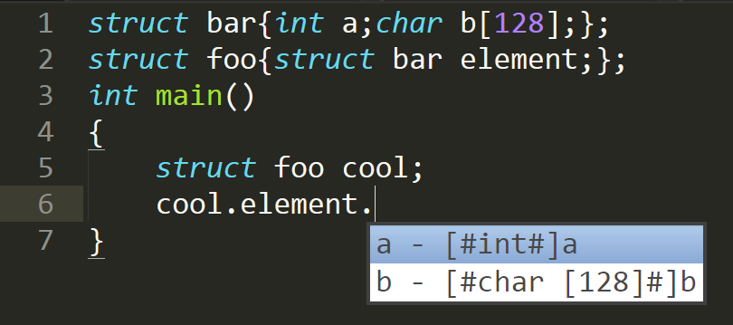

#ClangAutoComplete
=================

Sublime Text 3 plugin that offers auto-completion of C/C++ structure members or class attributes and methods.

##Installation

1. Install "clang". Note that some people reported issue with clang 3.5.2 when compiled from Cygwin. If you are facing issues on Windows, try to download directly from the official [clang website](http://llvm.org/releases/download.html).
2. Clone this repository and put it in your Sublime's packages directory (if manually installing from git).
3. Edit the settings to your needs.
4. Make sure Sublime's own auto-complete settings are properly configured, I've had trouble with mine.
Here is my C.sublime-settings as an example

        {
                "auto_complete": true,
                "auto_complete_selector": "source - comment",
                "auto_complete_triggers":
                [
                        {
                                "characters": "."
                        },
                        {
                                "characters": ">"
                        },
                        {
                                "characters": ":"
                        },
                ],
                "extensions":
                [
                        "c",
                        "h"
                ]
        }

##Settings

 - include_dirs: List of directories where relevant header files are located
 - autocomplete_all: Trigger auto-completion on every keypress (will slow down sublime)
 - selectors: List of characters that will trigger auto-completion ( if "autocomplete_all" is set to "false" )
 - clang_binary: Location of clang binary (if it is not in the path)
 
